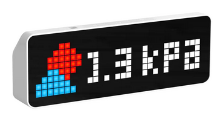

# Ulanzi TC001 API Monitor

Custom firmware for the Ulanzi TC001 pixel display clock that enables portable API monitoring for markets, trade shows and events.



## Table of Contents
- [Overview](#overview)
- [Hardware Specifications](#hardware-specifications)
- [Features](#features)
- [Requirements](#requirements)
- [Installation](#installation)
- [Configuration](#configuration)
- [Usage](#usage)
- [Battery Monitoring](#battery-monitoring)
- [API Requirements](#api-requirements)
- [Button Controls](#button-controls)
- [Development](#development)
- [Future Enhancements](#future-enhancements)
- [Troubleshooting](#troubleshooting)
- [License](#license)

## Overview

This firmware transforms your Ulanzi TC001 into a self-contained API monitoring device. Perfect for scenarios where you need portable, at-a-glance monitoring without relying on external infrastructure.

**Key Use Cases:**
- Markets: Social media followers
- Trade show booth metrics (visitor counts, lead generation)
- Support ticket monitoring on the go
- Real-time sales dashboards
- IoT sensor data display
- Any REST API with JSON responses

**Why This Over AWTRIX?**
AWTRIX requires an external server to POST data to the device. This firmware polls APIs directly from the device, making it ideal for portable use on public WiFi networks where you can't run external servers.

## What's New in v1.0.7

- **Password Protection** - All configuration pages are now protected by password authentication. Default password is `ulanzitc001`, configurable in General Settings
- **Session Management** - 30-minute session timeout with automatic refresh on activity
- **Secure Logout** - Logout button added to main page for secure session termination
- **Manual API Refresh** - Press the middle button (Button 2) for 1 second to force an immediate API refresh
- **Improved Button Handling** - Completely redesigned button state machine for cleaner, more scalable button combinations
- **Automatic URL Encoding** - API endpoints are now automatically URL-encoded, so you can paste URLs directly from documentation without manual encoding
- **HTML Form Security** - Fixed HTML escaping to properly handle special characters in configuration fields
- **Test API Timeout** - Added 10-second timeout to Test API function to prevent web UI lockups

## What's New in v1.0.6

- **MAC Address Fix** - Was not properly retrieving MAC address to generate unique device name

## What's New in v1.0.5

- **Interactive Icon Editor** - Added color picker for selecting paint colors, Made icon preview grid clickable to paint individual pixels, Added "Clear All" button to reset icon, Implemented two-way sync between JSON array and visual editor.
- **API Retry Logic** - Added 10 second timeout to API requests, Implemented automatic retry (up to 2 attempts) for network/timeout errors.

## What's New in v1.0.4

- **General Config** - Move display brightness to a general config page.
- **Reboot** - Able to reboot device from config page.
- **Tidy Up** - Tidied up the config screens, removed all the dedicated battery information as it was to much info.

## What's New in v1.0.3

### 🔋 Battery Monitoring Features

- **Real-time battery monitoring** - Voltage and percentage tracking
- **Web UI display** - Live battery status
- **Button combination** - Hold Button 2 + Button 3 to show battery on display
- **Low battery warnings** - Audio alerts at 20% (low) and 10% (critical)
- **Smart voltage curve** - Accurate LiPo battery percentage calculation

## Hardware Specifications

**Device:** Ulanzi TC001 Pixel Display Clock
**Display:** 32x8 WS2812 LED Matrix
**Microcontroller:** ESP32
**Battery:** Built-in LiPo battery (monitored via GPIO34)

### Pinout Reference
| GPIO | Function |
|------|----------|
| GPIO14 | Button 3 |
| GPIO15 | Buzzer |
| GPIO21 | I2C SDA |
| GPIO22 | I2C SCL |
| GPIO26 | Button 1 |
| GPIO27 | Button 2 |
| GPIO32 | WS2812 LED Matrix |
| GPIO34 | Battery ADC (voltage monitoring) |
| GPIO35 | Light Sensor |

## Features

### ✅ Current Features

#### WiFi Management
- 🔌 Access Point mode for initial setup
- 🌐 Web-based WiFi configuration
- 💾 Persistent credential storage
- 🔄 Easy reconfiguration via buttons

#### API Integration
- 🔗 Direct API polling (no external server needed)
- 🔐 Custom header authentication support
- ⏱️ Configurable polling intervals (5-3600 seconds)
- 🔄 Manual refresh via button hold (Button 2 for 1 second)
- 🧭 Flexible JSON path navigation with array filtering
- 📊 Support for nested objects and arrays
- 🔍 JSON Array filtering by field values (e.g., `users[name=John].age`)
- ✅ HTTPS support

#### Display
- 📜 Scrolling or static display modes
- 🎨 Color-coded status (green=ok, red=error, yellow=warning)
- 🖼️ 8x8 icon support (scrolls with text)
- 🏷️ Optional display prefix and suffix
- 📱 Real-time value updates
- 🎯 Automatic centering in static mode
- ⚡ Immediate API polling on startup (no waiting for first interval)

#### Brightness Control
- 🌞 Auto brightness using onboard light sensor
- 🎚️ Manual brightness slider (1-255)
- 🌙 Adaptive dimming for dark environments (as low as brightness 1)
- ☀️ Automatic brightening in daylight (up to brightness 255)
- 🎯 Non-linear curve optimized for indoor use
- 💾 Brightness settings persist across reboots
- 🔄 Real-time brightness updates every 100ms in auto mode

#### Icon Support
- 🎨 8x8 pixel RGB icons
- 🔄 Icons scroll with text
- 📋 JSON array format: `[[r,g,b],[r,g,b],...]`
- 👁️ Live design and preview in configuration interface
- 💾 Stored locally (no external dependencies)

#### Web Interface
- ⚙️ Full configuration page
- 🧪 API connection testing
- 📊 Status monitoring with battery info
- 🔄 Factory reset option
- 👁️ Icon preview before saving

#### Battery Management 🔋
- 📊 Real-time voltage and percentage monitoring
- 🔊 Low battery audio alerts (20% and 10%)
- 🎮 Button combination (Button 2 + 3) to show battery
- 📈 Non-linear voltage curve for accurate LiPo readings
- 🔔 Critical battery warnings with double beep

#### Security
- 🔒 Secure NVS storage for API keys
- 🎭 Masked API key display
- 💾 Persistent settings across reboots

#### Device Management
- 🆔 Unique device identification (MAC-based)
- 📡 Unique AP names per device
- 🔴 Hardware and web-based factory reset

## Requirements

### Hardware
- Ulanzi TC001 Pixel Display Clock
- USB-C cable for programming
- Computer with Arduino IDE

### Software
- [Arduino IDE](https://www.arduino.cc/en/software) 1.8.x or 2.x
- [Python](https://www.python.org/downloads/) (for firmware backup via esptool)

### Arduino Libraries
Install via Arduino Library Manager:
1. **WiFiManager** by tzapu
2. **Adafruit GFX Library**
3. **Adafruit NeoMatrix**
4. **Adafruit NeoPixel**
5. **ArduinoJson** by Benoit Blanchon (v6.x or v7.x)

Built-in ESP32 libraries (no installation needed):
- WiFi
- WebServer
- HTTPClient
- Preferences

## Installation

### Method 1: Web Installer (Recommended - Easiest!)

The easiest way to install or update the firmware is using our web-based installer:

**🌐 [Launch Web Installer](https://tommysharpnz.github.io/Ulanzi-TC001-API-Monitor/)**

**Requirements:**
- Google Chrome or Microsoft Edge browser
- USB cable connected to your TC001 device

**Steps:**
1. Visit the web installer link above
2. Click "Install Firmware v1.0.7" button
3. Select your TC001's serial port when prompted
4. Wait for installation to complete (about 30 seconds)
5. Device will restart automatically

**Benefits:**
- ✅ No software installation required
- ✅ Works on Windows, Mac, and Linux
- ✅ Preserves your WiFi and API settings during updates
- ✅ One-click installation process

### Method 2: Arduino IDE (For Developers)

If you want to modify the code or compile from source, use the Arduino IDE method below.

#### 1. Backup Stock Firmware (Recommended)

Before flashing custom firmware, backup the original:

```bash
# Install esptool
pip install esptool

# Backup firmware (replace COM3 with your port)
esptool.py --port COM3 --baud 115200 read_flash 0x0 0x400000 tc001_backup.bin
```

To restore stock firmware later:
```bash
esptool.py --port COM3 --baud 115200 write_flash 0x0 tc001_backup.bin
```

#### 2. Install Arduino IDE and Libraries

1. Download and install [Arduino IDE](https://www.arduino.cc/en/software)
2. Add ESP32 board support:
   - Go to **File → Preferences**
   - Add to "Additional Board Manager URLs": `https://raw.githubusercontent.com/espressif/arduino-esp32/gh-pages/package_esp32_index.json`
   - Go to **Tools → Board → Boards Manager**
   - Search for "ESP32" and install

3. Install required libraries:
   - **Sketch → Include Library → Manage Libraries**
   - Search and install each library from the Requirements section

#### 3. Upload Firmware

1. Open the `Ulanzi-TC001-API-Monitor.ino` sketch in Arduino IDE
2. Configure board settings:
   - **Tools → Board → ESP32 Arduino → ESP32 Dev Module**
   - **Tools → Port →** Select your TC001's COM port
3. Click **Upload** button
4. Wait for compilation and upload to complete

### Initial Setup (All Methods)

1. Device will create WiFi AP: `TC001-XXXXXX`
2. Connect to this AP with your phone/computer
3. Captive portal should open automatically (or navigate to `192.168.4.1`)
4. Configure your WiFi credentials
5. Device will connect and display its IP address
6. Browse to the displayed IP address to continue configuration

## Configuration

### Web Interface Authentication

The web interface is protected by password authentication to secure your configuration.

**Default Password:** `ulanzitc001`

When you first access the web interface at your device's IP address, you'll be presented with a login screen. Enter the default password to access the configuration pages.

**Changing the Password:**
1. Log in to the web interface
2. Navigate to General Settings (Config button)
3. Scroll to the "Admin Password" section
4. Enter your new password
5. Click "Save Settings"

**Session Management:**
- Sessions remain active for 30 minutes with automatic refresh on activity
- Click the "Logout" button on the main page to end your session
- If you forget your password, perform a factory reset (hold all 3 buttons for 3 seconds)

### Web Interface Configuration

Navigate to your TC001's IP address (displayed on the LED matrix) to access the configuration interface.

### API Settings

| Setting | Description | Example |
|---------|-------------|---------|
| **API Endpoint URL** | Full URL to your API (query parameters automatically encoded) | `https://api.example.com/data?filter=Name eq 'Value'` |
| **API Header Name** | Authentication header name | `APIKey`, `Authorization`, `X-API-Key` |
| **API Key** | Your API authentication key | `your-secret-key-here` |
| **JSON Path** | Path to value in JSON response | `OverdueWorkflows[Username=John].Overdue` |
| **Display Prefix** | Text before the value (optional) | `Tickets: ` |
| **Display Suffix** | Text after the value (optional) | ` open` |
| **Icon Data** | 8x8 RGB icon as JSON array (optional) | `[[255,0,0],[0,255,0],...]` |
| **Enable Scrolling** | Checkbox for scroll vs static mode | Checked = scrolling (default) |
| **Polling Interval** | Seconds between API calls | `60` (range: 5-3600) |
| **Auto Brightness** | Checkbox for automatic brightness control | Checked = use light sensor, Unchecked = manual |
| **Manual Brightness** | Slider for brightness level (when auto disabled) | `40` (range: 1-255) |

**Note about URL encoding:** You can paste API URLs directly from your API documentation. Special characters in query parameters (like spaces, quotes, etc.) are automatically URL-encoded when the request is sent. For example, `filter=Name eq 'John'` is automatically encoded to `filter=Name%20eq%20%27John%27`.

#### JSON Path Examples

The firmware supports flexible JSON path navigation with array filtering:

**Simple root level:**
```json
{ "count": 42 }
```
JSON Path: `count`

**Nested object:**
```json
{ "data": { "unassigned": 12 } }
```
JSON Path: `data.unassigned`

**Array access by index:**
```json
{ "results": [{ "value": 99 }] }
```
JSON Path: `results[0].value`

**Array filtering by field value:**
```json
{
  "OverdueWorkflows": [
    { "Username": "John", "Overdue": 5 },
    { "Username": "Jane", "Overdue": 12 }
  ]
}
```
JSON Path: `OverdueWorkflows[Username=Jane].Overdue`

**Complex nested:**
```json
{
  "TC001MatrixDisplay": [
    { "OpenRequests": 12 }
  ]
}
```
JSON Path: `TC001MatrixDisplay[0].OpenRequests`

#### Array Filtering Syntax

Use the format `arrayName[fieldName=value]` to filter arrays:
- `users[name=John].age` - Find user with name "John" and get their age
- `products[id=12345].price` - Find product with id "12345" and get price
- `tickets[status=open].count` - Find ticket with status "open" and get count

This searches through the array and returns the first object where the field matches the value.

### Icon Configuration

Icons are 8x8 pixels in RGB format. The JSON array should contain exactly 64 pixel values:

```json
[[255,0,0],[255,0,0],[0,0,0],[0,0,0],[0,0,0],[0,0,0],[255,0,0],[255,0,0],
 [255,0,0],[255,0,0],[0,0,0],[0,0,0],[0,0,0],[0,0,0],[255,0,0],[255,0,0],
 ...64 total pixels...]
```

Each pixel is `[red, green, blue]` with values 0-255.

The web interface provides a live preview of your icon before saving. Icons scroll alongside the text when scrolling is enabled, or display static with centered text when scrolling is disabled.

### Display Modes

**Scrolling Mode (default):**
- Icon and text scroll continuously from right to left
- Ideal for longer text or when you want continuous motion
- Full content visibility over time

**Static Mode:**
- Content is centered on the display
- Perfect for short displays (e.g., icon + number)
- If content is wider than 32 pixels, it left-aligns
- Ideal for at-a-glance monitoring

### Brightness Configuration

The TC001 offers two brightness control modes to suit different environments and preferences.

**Auto Brightness Mode (Recommended):**
- Uses the onboard light sensor (GPIO35) to automatically adjust brightness
- Adapts in real-time to ambient lighting conditions
- Brightness ranges:
  - **Very dark** (sensor 0-100): Brightness 1-5 (very dim for nighttime)
  - **Dim room** (sensor 100-500): Brightness 5-30 (low for dark rooms)
  - **Normal indoor** (sensor 500-2000): Brightness 30-120 (comfortable for typical indoor lighting)
  - **Bright light** (sensor 2000-4095): Brightness 120-255 (high for daylight/bright rooms)
- Updates every 100ms for smooth transitions
- Perfect for displays in rooms with varying light throughout the day

**Manual Brightness Mode:**
- Fixed brightness level set via slider (1-255)
- Brightness 1 = barely visible (ideal for very dark rooms)
- Brightness 40-80 = comfortable for normal indoor use
- Brightness 150-255 = very bright (for well-lit areas or outdoor use)
- Useful when consistent brightness is preferred

**Tip:** Start with auto brightness mode and observe the display throughout the day. If you find it too bright or dim at certain times, you can switch to manual mode and set your preferred level.

### Testing API Connection

You must save API configuration before using the **Test Connection** button to verify:
- API endpoint is reachable
- Authentication is working
- JSON path correctly extracts the value
- Response format is as expected

### Battery Monitoring

The TC001 has a built-in LiPo battery that is continuously monitored. The firmware provides comprehensive battery information:

Battery Voltage Ranges
- **4.2V** = 100% (fully charged)
- **3.9V** = ~75% (good)
- **3.7V** = ~40% (moderate)
- **3.5V** = ~15% (low)
- **3.0V** = 0% (empty)

#### Audio Alerts
- **Single beep** = Low battery warning (20%) - plays once per boot
- **Double beep** = Critical battery (10%) - repeats periodically

#### Viewing Battery Status

Method 1: Web Interface
1. Navigate to your TC001's IP address in a browser
2. Battery status appears at the top with:
   - Percentage and voltage display

Method 2: Button Combination
1. **Hold Button 2 + Button 3** together for 0.5 seconds
2. Battery information displays on the LED matrix for 3 seconds

#### Battery Monitoring Configuration

Battery monitoring runs automatically with these settings:
- **Update interval:** 10 seconds
- **Samples per reading:** 10 (averaged for stability)
- **Low battery threshold:** 20%
- **Critical threshold:** 10%

## Usage

### Daily Operation

Once configured, the device will:
1. Auto-connect to saved WiFi on startup
2. Begin polling the API at configured intervals
3. Display the current value (scrolling or static based on settings)
4. Update automatically when new data arrives
5. Show error messages if API fails

### Display States

| Color | Meaning |
|-------|---------|
| 🟢 Green | Normal operation, displaying API value |
| 🔴 Red | Error state (connection failed, parsing error) |
| 🟡 Yellow | Not configured or warning |

### Example Configurations

#### Example 1: Support Tickets (Scrolling with Icon)
**API Response:**
```json
{
  "StatusCode": 200,
  "Summary": "OK",
  "RecordCount": 1,
  "TC001MatrixDisplay": [
    { "OpenRequests": 12 }
  ]
}
```

**Configuration:**
- API Endpoint: `https://support.yourcompany.com/api/tickets`
- Header Name: `APIKey`
- API Key: `Bi...5#`
- JSON Path: `TC001MatrixDisplay[0].OpenRequests`
- Display Prefix: `Tickets: `
- Display Suffix: ` open`
- Icon Data: `[[...]]` (ticket icon)
- Enable Scrolling: ✅ Checked
- Polling Interval: `60`
- Auto Brightness: ✅ Checked
- Manual Brightness: N/A (auto mode)

**Result:** Icon and "Tickets: 12 open" scroll continuously, updates every 60 seconds, brightness adjusts automatically to room lighting.

#### Example 2: Personal Workflow Count (Static Display)
**API Response:**
```json
{
  "OverdueWorkflows": [
    { "Username": "Sue Walker", "Overdue": 1, "Today": 0 },
    { "Username": "John Smith", "Overdue": 5, "Today": 2 }
  ]
}
```

**Configuration:**
- API Endpoint: `https://workflow.company.com/api/stats`
- JSON Path: `OverdueWorkflows[Username=Sue Walker].Overdue`
- Display Prefix: `` (empty)
- Display Suffix: `` (empty)
- Icon Data: `[[...]]` (person icon)
- Enable Scrolling: ⬜ Unchecked (static)
- Polling Interval: `300`
- Auto Brightness: ⬜ Unchecked
- Manual Brightness: `80`

**Result:** Icon and number "1" centered on display, updates every 5 minutes, fixed brightness at 80 for consistent visibility.

#### Example 3: Bitcoin Price
**API Response:**
```json
{
    "symbol": "BTCUSDT",
    "price": "95574.27000000"
}
```

**Configuration:**
- API Endpoint: `https://api.binance.com/api/v3/ticker/price?symbol=BTCUSDT`
- API Key: (leave blank - no auth needed)
- JSON Path: `price`
- Display Prefix: `BTC: $`
- Display Suffix: `` (empty)
- Enable Scrolling: ✅ Checked
- Polling Interval: `120`
- Auto Brightness: ✅ Checked
- Manual Brightness: N/A (auto mode)

**Result:** "BTC: $43250.5432" scrolls continuously, updates every 2 minutes, brightness adapts to lighting conditions.

## API Requirements

Your API must meet these requirements:

### Required
- ✅ HTTP/HTTPS GET endpoint
- ✅ JSON response format
- ✅ Stable endpoint URL

### Optional
- ⚙️ Header-based authentication (APIKey, Authorization, etc.)

### Response Format
The API can return any valid JSON structure. Use the JSON path configuration to navigate to your desired value. Values can be:
- Numbers: `42`, `3.14`
- Strings: `"active"`, `"12 items"`
- Booleans: `true`, `false`

## Button Controls

### Hardware Buttons

| Action | Result |
|--------|--------|
| **Hold Button 1 during startup** | Enter WiFi configuration mode |
| **Hold Button 2 for 1 second** | Force immediate API refresh (manual update) |
| **Hold Button 2 + Button 3 for 0.5s** | Show battery status on display (3 seconds) |
| **Hold all 3 buttons for 3 seconds** | Factory reset (WiFi + API settings) |
| **Hold Left (Button 1) + Right (Button 3) buttons** | Power on/off (hardware feature) |

### Factory Reset

Two ways to factory reset:
1. **Hardware:** Hold all 3 buttons for 3 seconds (device beeps twice)
2. **Web Interface:** Click "Factory Reset" button on home page

Factory reset clears:
- ✅ WiFi credentials
- ✅ API configuration
- ✅ Icon data
- ✅ All stored settings

Device will restart in AP mode for reconfiguration.

## Development

### Project Structure

Currently single-file Arduino sketch:
```
Ulanzi-TC001-API-Monitor/
├── Ulanzi-TC001-API-Monitor.ino    # Main firmware file
├── README.md                       # Documentation
├── Ulanzi-TC001-API-Monitor.bin    # Pre-compiled firmware binary
├── docs/                           # GitHub Pages web installer
│   ├── index.html                  # Web installer interface
│   ├── manifest.json              # ESP Web Tools manifest
│   └── firmware/                  # Firmware binaries folder
│       ├── bootloader.bin         # ESP32 bootloader
│       ├── partitions.bin         # Partition table
│       ├── boot_app0.bin          # Boot app
│       └── Ulanzi-TC001-API-Monitor.bin  # Application binary
└── images/                        # Documentation images
```

### Code Organization

Main components:
- **WiFi Management** - WiFiManager integration, AP mode
- **Web Server** - Configuration interface, status pages
- **API Client** - HTTP requests, JSON parsing with array filtering
- **Display Manager** - LED matrix control, scrolling and static modes
- **Icon Handler** - JSON icon parsing, RGB565 conversion, rendering
- **Battery Monitor** - Voltage reading, percentage calculation, alerts
- **Storage** - NVS preferences for configuration
- **Button Handler** - Physical button controls

### Building and Publishing Releases

If you're a developer creating a new release, follow these steps to generate all required binary files for the web installer:

#### 1. Export Compiled Binaries from Arduino IDE

1. Open `Ulanzi-TC001-API-Monitor.ino` in Arduino IDE
2. Configure board settings:
   - **Tools → Board → ESP32 Arduino → ESP32 Dev Module**
   - **Tools → Partition Scheme → Default 4MB with spiffs (1.2MB APP/1.5MB SPIFFS)**
3. Go to **Sketch → Export Compiled Binary** (or press Ctrl+Alt+S)
4. Wait for compilation to complete
5. Arduino IDE will create several files in your sketch folder:
   - `Ulanzi-TC001-API-Monitor.ino.bin` - Main application
   - `Ulanzi-TC001-API-Monitor.ino.bootloader.bin` - Bootloader
   - `Ulanzi-TC001-API-Monitor.ino.partitions.bin` - Partition table

#### 2. Get boot_app0.bin

The `boot_app0.bin` file is not exported by Arduino IDE but is required for ESP32 flashing. You can find it in your Arduino ESP32 package:

**Windows:**
```
C:\Users\<YourUsername>\AppData\Local\Arduino15\packages\esp32\hardware\esp32\<version>\tools\partitions\boot_app0.bin
```

**Mac:**
```
~/Library/Arduino15/packages/esp32/hardware/esp32/<version>/tools/partitions/boot_app0.bin
```

**Linux:**
```
~/.arduino15/packages/esp32/hardware/esp32/<version>/tools/partitions/boot_app0.bin
```

#### 3. Copy Files to Web Installer Folder

Copy and rename the exported files to `docs/firmware/`:

```bash
# Copy main application (rename to remove .ino)
cp Ulanzi-TC001-API-Monitor.ino.bin docs/firmware/Ulanzi-TC001-API-Monitor.bin

# Copy bootloader
cp Ulanzi-TC001-API-Monitor.ino.bootloader.bin docs/firmware/bootloader.bin

# Copy partition table
cp Ulanzi-TC001-API-Monitor.ino.partitions.bin docs/firmware/partitions.bin

# Copy boot_app0.bin from Arduino ESP32 package
cp <path-to-arduino15>/packages/esp32/hardware/esp32/<version>/tools/partitions/boot_app0.bin docs/firmware/boot_app0.bin
```

#### 4. Update Version Numbers

Update version numbers in these files:
- `Ulanzi-TC001-API-Monitor.ino` - Line 12: `String buildNumber = "vX.X.X";`
- `docs/manifest.json` - Line 3: `"version": "X.X.X",`
- `docs/index.html` - Line 7 (title) and line 22 (version display)
- `README.md` - "What's New" section at the top

#### 5. Test the Web Installer Locally

Before pushing to GitHub, test the web installer locally:

1. Start a local web server in the `docs` folder:
   ```bash
   cd docs
   python -m http.server 8000
   ```

2. Open Chrome/Edge and navigate to `http://localhost:8000`
3. Test the installation process with your TC001 device
4. Verify settings are preserved during update

#### 6. Commit and Push to GitHub

```bash
git add .
git commit -m "Release vX.X.X - Description of changes"
git push origin main
```

#### 7. Enable GitHub Pages

If not already enabled:
1. Go to repository **Settings → Pages**
2. Source: **Deploy from a branch**
3. Branch: **main** → **/docs** folder
4. Click **Save**

GitHub Pages will be available at: `https://tommysharpnz.github.io/Ulanzi-TC001-API-Monitor/`

#### Binary File Addresses Reference

For manual flashing or troubleshooting:
```
0x1000  (4096)   - bootloader.bin
0x8000  (32768)  - partitions.bin
0xE000  (57344)  - boot_app0.bin
0x10000 (65536)  - Ulanzi-TC001-API-Monitor.bin (main application)
```

The web installer automatically flashes all files at the correct addresses.

## Future Enhancements

Planned features for future releases:

### High Priority
- [ ] Concept of "screens" allowing for multiple API endpoint support with button navigation or auto rotation
- [ ] Multiple API endpoints with button navigation

### Medium Priority
- [ ] Threshold-based color coding (e.g., red if value > 10)
- [ ] Time display option
- [ ] Temperature/weather display

### Low Priority
- [ ] OTA (Over-The-Air) firmware updates
- [ ] Show recent serial log entries in web config UI

## Troubleshooting

### Device Won't Connect to WiFi

**Symptoms:** Device stuck in AP mode or shows "WIFI FAIL"

**Solutions:**
1. Hold Button 1 during startup to manually enter config mode
2. Verify WiFi credentials are correct
3. Check WiFi signal strength
4. Ensure 2.4GHz network (ESP32 doesn't support 5GHz)

### API Not Updating

**Symptoms:** Display shows old value or error message

**Solutions:**
1. Use "Test Connection" button in web interface
2. Check API endpoint is accessible from device's network
3. Verify API key is correct and not expired
4. Confirm JSON path matches actual response structure
5. Check Serial Monitor for detailed error messages

### Display Shows Wrong Value

**Symptoms:** Extracted value doesn't match expected data

**Solutions:**
1. Verify JSON path syntax in configuration
2. Use "Test Connection" to see raw API response
3. Check for array indices starting at 0
4. Ensure nested object paths use correct notation
5. For array filtering, verify field names and values match exactly

### Icon Not Displaying

**Symptoms:** Icon doesn't appear or shows incorrectly

**Solutions:**
1. Verify JSON array has exactly 64 pixels
2. Check preview in web interface before saving
3. Ensure each pixel is `[r,g,b]` format with values 0-255
4. Clear icon data field and re-paste if corrupted
5. Check serial monitor for icon parsing errors

### Can't Access Web Interface

**Symptoms:** Can't browse to device's IP address

**Solutions:**
1. Verify device is on same network as your computer/phone
2. Check IP address shown on LED display
3. Try pinging the device: `ping 192.168.x.x`
4. Reboot the device (power cycle)
5. Factory reset and reconfigure if needed

### Serial Monitor Debug

Connect USB and open Serial Monitor (115200 baud) to see:
- Startup messages
- WiFi connection status
- Battery voltage and percentage
- API request/response details
- JSON parsing results
- Icon parsing status
- Error messages

## Technical Notes

### Storage
- WiFi credentials stored in ESP32 WiFi NVS
- API settings stored in custom NVS namespace: `tc001`
- Settings persist across firmware updates
- Factory reset clears both WiFi and custom NVS
- Icon data stored as JSON string (max ~512 bytes)

### Battery Monitoring Details
- ADC: 12-bit resolution (0-4095) on GPIO34
- Reference voltage: 3.3V
- Voltage divider: Typically 2:1 ratio
- Update frequency: Every 10 seconds
- Samples per reading: 10 (averaged)
- Non-linear voltage curve for LiPo batteries

### Security Considerations
- API keys stored in plaintext in NVS
- Keys only masked in web UI display
- Use HTTPS endpoints when possible

### Network Requirements
- Requires 2.4GHz WiFi (ESP32 limitation)
- Outbound HTTP/HTTPS connectivity needed
- No incoming connections required
- May not work on networks with captive portals

### Performance
- Typical API response time: 200-500ms
- Display update rate: 50ms per scroll step (scrolling mode)
- Static mode: Updates every 1 second
- Auto brightness: Updates every 100ms
- Battery monitoring: Updates every 10 seconds
- Memory usage: ~150KB RAM with icon loaded

### Brightness Control Details
- Light sensor: 12-bit ADC (0-4095 range) on GPIO35
- Auto mode brightness mapping:
  - Very dark (0-100): Brightness 1-5
  - Dim room (100-500): Brightness 5-30
  - Normal indoor (500-2000): Brightness 30-120
  - Bright light (2000-4095): Brightness 120-255
- Manual mode: Direct brightness control (1-255)
- Brightness settings stored in NVS, persist across reboots
- Updates apply immediately upon saving configuration

## Contributing

Contributions welcome! Areas for improvement:
- Documentation improvements
- Bug fixes and testing
- Battery monitoring enhancements
- New features
- Icon library
- Example configurations

## License

This project is open source and available under the MIT License.

## Acknowledgments

- **Ulanzi** for the TC001 hardware platform
- **tzapu** for the excellent WiFiManager library
- **Adafruit** for the LED matrix libraries
- **Benoit Blanchon** for ArduinoJson
- The ESP32 Arduino community

## Support

For issues, questions, or feature requests:
- Open an issue on GitHub
- Check existing issues for solutions
- Consult the troubleshooting section above

---

**Device Identification:**
- Device Name Format: `TC001-Display-XXXXXX`
- AP Name Format: `TC001-XXXXXX`
- Where XXXXXX = Last 6 characters of MAC address
